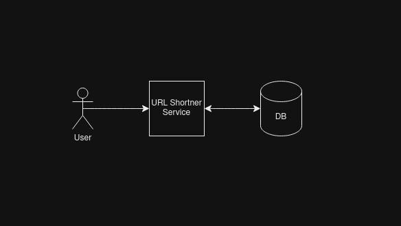

# urlshortner
A Simple URL Shortner

Purpose of the project is to learn how various technologies will affect the services performance

You can find each of the stages in these following branches.

- master ( contains the latest progress )
- v1_naive_normal_db ( contains naive approach of storing in a database only )

# How to deploy

You need to run `docker-compose up --build` after cloning the repository.

If the deployment has been completed succesfully, you can see the following message
```
Listenting on 127.0.0.1:8080
```

Fire up your browser and visit 127.0.0.1:8080 to use the service.

# Benchmarks
Note: I have only tested locally

### Test Plan:
- URL size of 100 chars
- Measure of 100000 writes to the database with concurrency of 10000
- Measure of 100000 reads to the database with concurrency of 10000

# v1_naive_normal_db - The naive approach

I wanted to benchmark how does a simple setup like the following will perform. 



Results

| Request/Sec | Time/Req  (in milliseconds) |
|-------------|-----------------------------|
| 2678.84     | 3732.9                      |
